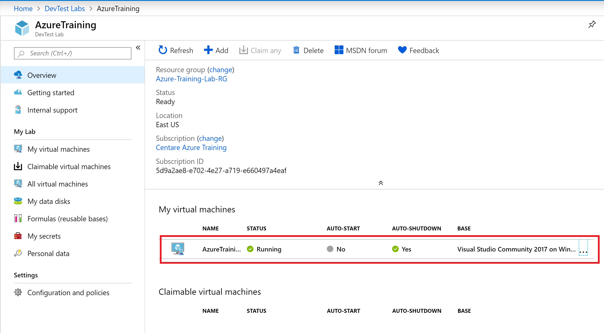
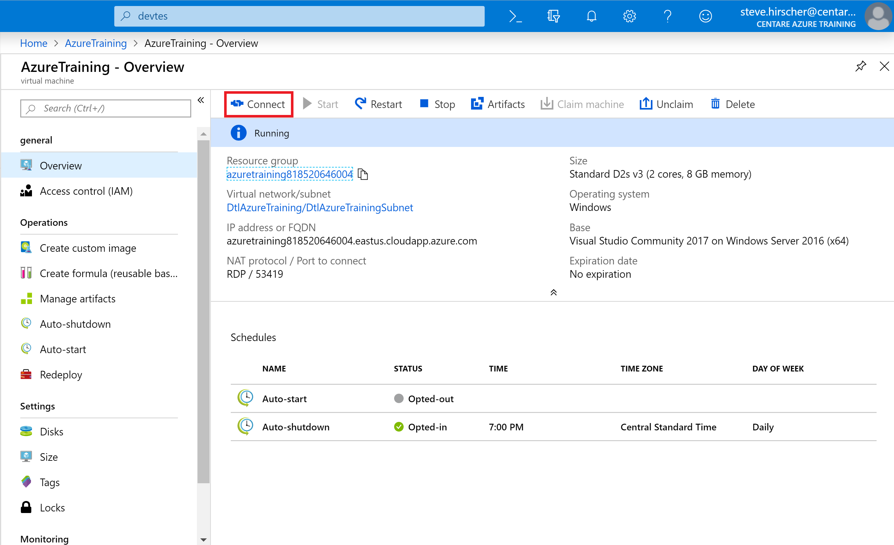

# Azure Portal

The Azure Portal is a web based UI for Azure. Everything you can do in Azure CLI, you can do in the portal. Generally, the CLI is a more efficient way to generate resources, but the portal is great for exploration and monitoring resources.

In this exercise, you're going to use the Azure Portal to create some resources.

<!--
> If you haven't activated you MSDN Azure benefits yet, go to [my.visualstudio.com](https://my.visualstudio.com) and activate them.
-->

1. Head over to [portal.azure.com](https://portal.azure.com) and log in with:
    
    User Name: **[Your CUNA user name]@centareazuretraining.onmicrosoft.com**  
    Password: **AzureTraining1!**

    > You will be greeted with a welcome message that gives you the option get a quick tour of the portal. Click "Start Tour" to get a brief overview of some of the major menu items we will be using.

2. Create a Resource Group
    * On the left hand menu, click "Resource Groups". This will bring up the Resource Group list.

    > Resource groups logically group Azure resources, like web apps and databases. Generally, you make a resource group per application.

3. Click "Add". This will bring up the "Create a Resource Group" blade. When navigating in the portal, new items often open new windows.

4. Fill out the form.
    <!--    * Select the appropriate subscription. If you have an MSDN subscription, pick the Visual Studio subscription. If you are using the free $200 credits, select the Free Trial subscription.-->
    * In the Resource Group field enter **"[Your CMUTUAL user name]-lunch-webapp-rg"**. For example: **"shk6756-lunch-webapp-rg"**. This resource group name will be referenced in subsequent exercises, so please use this naming convention.
    > Resource group names only need to be unique within a subscription. We are adding in your user name since you are sharing a subscription with other class members.

    > There are many options for resource and resource group naming conventions. Using all lower case letters with dashes (except for storage accounts which can't have dashes) and pre or post-fixing the name with an abbreviation for the type of resource is common.  For example: "my-application-rg" for your resource group name. You will see this basic pattern in most of the exercises, however, a real world naming convention will likely be more complex.

    * Select the East US region for the resource group.

    > Resource groups can contain resources from any region.  The region selected for the resource group simply determines where the meta-data for the resource group is stored (like the log files and security settings).

5. Click "Review + Create" to move on to the review page. This page lists all changes that will be made. Click "Create". You should see your resource group in the list after a few seconds.

# Claim an Azure DevTest Labs virtual machine

For the rest of our exercises we will be using a pre-built development virtual machine. This machine is managed by the Azure DevTest Labs service, which allows you to spin up pre-built VM images for development, testing, or training purposes.

In the [Azure Portal](https://portal.azure.com):

1. Select All Services, and then select DevTest Labs in the DEVOPS section. If you select * (star) next to DevTest Labs in the DEVOPS section. This action adds DevTest Labs to the left navigational menu so that you can access it easily the next time. Then, you can select DevTest Labs on the left navigational menu.

    

2. In the list of labs select **AzureTraining**

3. At the top of the **"Overview"** pane, choose **Claim any**. A random virtual machine is assigned from the list of claimable VMs.

    

4. The machine will take a minute or two to start.

5. After a VM is claimed, it is moved from the **Claimable virtual machines** list up into the **My virtual machines** list.  Click on the machine you have claimed.

    > You may have to hit the **Refresh** button at the top of the Overview pane to see the machine show up as claimed.

    

6. At the top of the **"Overview"** pane, click on the **Connect** button. This will download a remote desktop file you can use to connect to the machine.

    

7. Run the RDP file and log in as the same user name and password you used to log into the portal (minus the domain):

    User Name: **[Your CUNA user name]**  
    Password: **AzureTraining1!**

    > The default user will be "azuretraining".  You will need to change the user name to your own.  In the latest version of RDP select **More Choices** -> **Use a different account** to make the user name textbox editable.

    

### Further Exploration
Open the Azure portal using the link on the desktop, do some exploring and see what's available. Check out the options on your resource group.

Congrats, you just made your own resource group using the Azure Portal. In the next exercise, you'll explore the Azure CLI.

Next: [Azure Shell](02-azure-shell.md)
