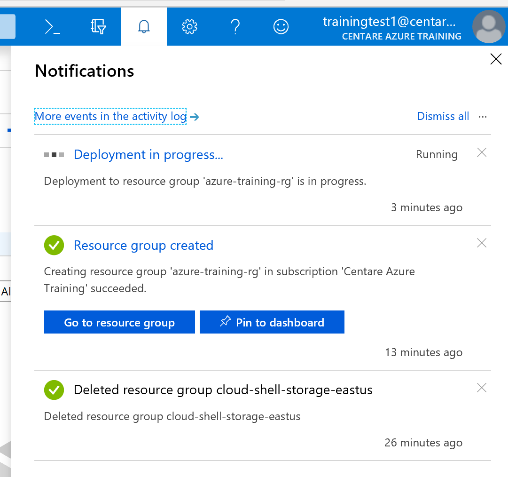

# SQL Server in Azure

In this exercise You’re going to create your first resource in Azure a SQL Server Database in Azure. We will use this database in subsequent exercises as the back end for a lunch ordering system. You can use the portal **or** the CLI. Instructions for both are included in this step.

## SQL Server (in the portal)

Steps

1. Open the portal ([portal.azure.com](https://portal.azure.com))

2. Click "Create a Resource" (top left corner)

3. Click "Databases" then "SQL Database". If you don't see it, search for SQL Database.

4. Fill out the Basic Tab

	- Select a subscription
	- Select the resource group you created in the previous step named **"[your CMUTUAL user name]-lunch-webapp-rg"**.
	- Enter **"lunch-db"** as the database name
	- Under Server, click “Create New”
	- Fill out the server name. Server names must be globally unique, so use **"[your CMUTUAL user name]-lunch-sql"**
	- Enter **"lunchadmin"** and **"%Lunch4U!"** as the user name and password.
	- Click “Next”

	> You must use the specified values for server name (**[your CMUTUAL user name]-lunch-sql**), database name (**lunch-db**) and credentials (**lunchadmin** / **%Lunch4U!**). We will be using this Azure SQL Server for subsequent exercises.

5. On the Additional Settings and Tags tabs, Click Next

6. Click Create

7. A new message will pop up in your Notifications menu for your resource deployment that will alert you when the deployment is complete.

	

Once the database is deployed (this takes a few minutes), you can click **Go to resource** in your Notifications or to the SQL databases resource in the left menu.

8. Setup the SQL Server Firewall
* Open your Database
* On the main page, click "Set server firewall" 
* On the firewall settings page, toggle "Allow access to Azure services" from "OFF" to "ON". 
* Add your client ip address by clicking on "+ Add Client IP" (you can get your IP by visiting whatismyip.com)
* Click Save

> SQL Server is locked down by default, only allowing specific IP address ranges. You'll need to add your local IP to connect using SQL Server Management Studio.

9. Feel free to connect to the server using your preferred SQL tool (SQL Server Management Studio or Visual Studio)

In SQL Server Management, here are the connection options you'll need: 

**Server Type:** Database Engine  
**Servername:** [your CMUTUAL user name]-lunch-sql.database.windows.net (e.g. shk6756-lunch-server.database.windows.net)  
**Authentication:** SQL Server Authentication  
**Login:** lunchadmin  
**Password:** %Lunch4U!  

If you didn't configure the firewall correctly, you'll get a prompt to login to Azure to add your IP address to the firewall. Enter your login and follow the prompts.

## SQL Server (using the CLI)

1. Setup some variables

```PowerShell
$sqlAdminUserName='lunchadmin'
$sqlAdminPassword='%Lunch4U!'
# The $env variable is a built in Powershell value that allows you to access system information.
# Here we are using it to get your Windows user name to make your SQL Server name unique.
# See https://docs.microsoft.com/en-us/powershell/module/microsoft.powershell.core/about/about_environment_variables?view=powershell-6
$sqlServerName="$env:username-lunch-sql"

# Your resource group from exercise 1
$resourceGroupName="$env:username-lunch-webapp-rg"

#This is the DB we'll use later
$sqlDatabaseName='lunch-db'
```

2. Create a Database Server

```powershell
az sql server create `
	--name $sqlServerName `
	--resource-group $resourceGroupName `
	--location eastus  `
	--admin-user $sqlAdminUserName `
	--admin-password $sqlAdminPassword
```

> This will take a few minutes. That's OK. This command will create the server your SQL database will run on.

3. Make a database on the server

```powershell
az sql db create `
	--resource-group $resourceGroupName `
	--server $sqlServerName `
	--name $sqlDatabaseName `
	--service-objective S0
```

> This command will make your SQL database on the server you made in the previous step.

4. Allow connections from other Azure Services

```powershell
az sql server firewall-rule create -g $resourceGroupName -s $sqlServerName -n "allowAzure" --start-ip-address 0.0.0.0 --end-ip-address 0.0.0.0
```

> This command creates a firewall rule that allows Azure resources to connect to the server. Setting it to a range of 0.0.0.0 - 0.0.0.0 allows any Azure service.

### Further Exploration
Go into the Azure portal and check out the database you made.

Connect to the server using your preferred SQL tool (SQL Server Management Studio or Visual Studio)

In SQL Server Management, here are the connection options you'll need: 

Server Type: Database Engine  
Servername: [Your CMUTUAL user name]-lunch-sql.database.windows.net (example shk6756-lunch-sql.database.windows.net)  
Authentication: SQL Server Authentication  
Login: lunchadmin  
Password: %Lunch4U!  

You'll get a prompt to login to Azure to add your IP address to the firewall. Enter your login and follow the prompts.

Next: [Build a Web Application](04-web-apps.md)
