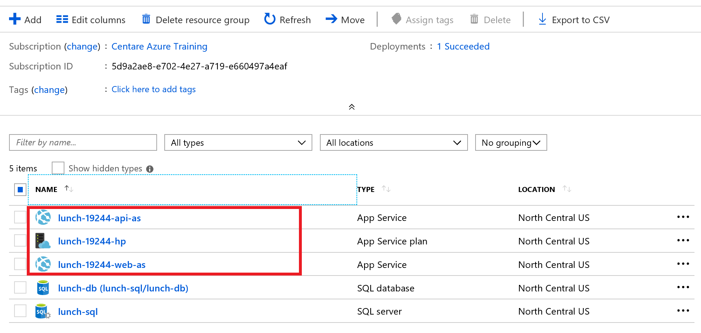

# Exercise 1: Web Apps and Azure SQL

In this exercise we will deploy a .Net website with a SQL back end to an Azure Web Application which connects to the managed Azure SQL instance you created in the previous exercise.

The application consists of an ASP.Net Core API project, and an ASP.Net Core website that serves up the home page for an Angular single page application.

> This exercise builds on the Azure SQL Server created in exercise 3. If you did not complete it or made potentially breaking changes to the configuration you can run the following script to delete any resources you have and recreate the server:
> ```powershell
> ./azure-sql/complete.ps1
> ```

## Create an Azure App Service Hosting Plan with two App Services for your UI and API

1. Open up a PowerShell window and navigate to the azuretraining folder you downloaded in step 2.

2. Set a variable for the resource group you created in previous exercises. We will use this variable in many of the commands for this exercise so we don't have to retype it.

    ```powershell
    $resourceGroupName = "$env:username-lunch-webapp-rg"
    ```

    > The $env variable is a built in Powershell value that allows you to access system information. Here we are using it to get your Windows user name to make your resource group name is unique in case you are sharing a subscription with other class members.

3. Create an App Service Plan using the Standard tier.

    ```powershell
    # The name of the hosting plan that will contain the app services
    $appServicePlanName = "$env:username-lunch-hp"

    az appservice plan create -g $resourceGroupName `
    --name $appServicePlanName `
    --sku S1 `
    --location eastus 
    ```

> You should now have an app service plan. An app service plan is a group of servers that underlie hosting options. This is the Azure equivalent of setting up an IIS server and putting your apps on it.

4. Create a Web App that uses the App Service Plan for the front end UI.

    ```powershell
    # the name of the app service, the URL for your site will be https://[app servicename].azurewebsites.net
    $webAppServiceName = "$env:username-lunch-web-as"

    az webapp create -n $webAppServiceName `
                    -p $appServicePlanName `
                    -g $resourceGroupName `
                    --verbose
    ```

    > This is like creating a new website in IIS.

    ```powershell
    # Grab the hostname of the site. You can also look this up in the Azure portal.

    az webapp show --name $webAppServiceName `
                   --resource-group $resourceGroupName `
                   --query defaultHostName `
                   -o table
    ```

    > You can use the query option to filter on specific fields. This is a handy way to get specific values to use in later variables. Try querying some different fields on the object.

5. Open up a browser go to the URL https://[Your CMUTUAL user name]-lunch-web-as.azurewebsites.net.  A default web application page should be displayed.

6. Create an App Service in the hosting plan for the APIs.

    ```powershell
    # The name of the app service, the URL for your site will be https://[app servicename].azurewebsites.net
    $apiAppServiceName = "$env:username-lunch-api-as"

    az webapp create -n $apiAppServiceName `
                    -p $appServicePlanName `
                    -g $resourceGroupName `
                    --verbose

    # Grab the hostname of the site. You can also look this up in the Azure portal.

    az webapp show --name $apiAppServiceName `
                   --resource-group $resourceGroupName `
                   --query defaultHostName `
                   -o table
    ```

7. Verify your API app was created by navigating to the app service URL in a browser (https://[Your CMUTUAL user name]-lunch-api-as.azurewebsites.net).

8. Open the Azure portal at https://portal.azure.com.  Navigate to your resource group.  You should see resources for the App Hosting Plan and the two App Services in that plan.  Open them up and explore the options available for monitoring and configuring your App Service.

    

## Deploy your code to the UI and API App Services

We'll deploy our code using a zip file deploy.

The application code for the website and API has already been created for you. You will publish it to a local folder and deploy it using zip deployments.

9. Build the web and API applications. You may need to install the [.NET Core 2.2 SDK](https://dotnet.microsoft.com/download/visual-studio-sdks)

    ```powershell
    # Build the ASP.Net Core API project
    dotnet publish ./web-apps-powershell/src/WebAppFoodOrder.Api/WebAppFoodOrder.Api.csproj -o ./publish/webapi

    dotnet publish ./web-apps-powershell/src/WebAppFoodOrder.Web/WebAppFoodOrder.Web.csproj -o ./publish/webapp
    ```

10. Zip up the output of the publish operations

    ```powershell
    Compress-Archive -Path ./web-apps-powershell/src/WebAppFoodOrder.Api/publish/webapi/* -DestinationPath ./web-apps-powershell/src/WebAppFoodOrder.Api/publish/webappapi.zip -Force

    Compress-Archive -Path ./web-apps-powershell/src/WebAppFoodOrder.Web/publish/webapp/* -DestinationPath ./web-apps-powershell/src/WebAppFoodOrder.Web/publish/webappweb.zip -Force
    ```

11. Deploy API application using zip file deployment.

    ```powershell
    az webapp deployment source config-zip  -g $resourceGroupName `
                    -n $apiAppServiceName `
                    --src ./web-apps-powershell/src/WebAppFoodOrder.Api/publish/webappapi.zip
    ```

12. Deploy the web application using zip file deployment.

    ```powershell
    az webapp deployment source config-zip  -g $resourceGroupName `
                    -n $webAppServiceName `
                    --src ./web-apps-powershell/src/WebAppFoodOrder.Web/publish/webappweb.zip
    ```

13. Update the web app service's configuration settings with the URL of the API.

    ```powershell
    $newAppSettings= "ApiDomain=https://$apiAppServiceName.azurewebsites.net"
    az webapp config appsettings set --settings $newAppSettings `
                        -n $webAppServiceName `
                        -g $resourceGroupName

    ```

14. Update the API app service's configuration settings with the SQL server location, database name, and credentials you used in the Azure SQL exercise. We will also set the ASPNETCORE_ENVIRONMENT variable to "Development" so ASP.Net Core will show us exception details if we have any issues.

    ```powershell
    # Grab these from exercise 3 or make a new database
    $sqlServerName = "$env:username-lunch-sql"
    $sqlDatabaseName = "lunch-db"
    $sqlAdminUserName = "lunchadmin"
    $sqlAdminPassword = "%Lunch4U!"

    $connectionString = "Server=tcp:$sqlServerName.database.windows.net,1433;Initial Catalog=$sqlDatabaseName;Persist Security Info=False;User ID=$sqlAdminUserName;Password=$sqlAdminPassword;MultipleActiveResultSets=False;Encrypt=True;TrustServerCertificate=False;Connection Timeout=30;"

    az webapp config connection-string set -g $resourceGroupName `
                        -n $apiAppServiceName -t SQLAzure `
                        --settings MenuConnection=$connectionString OrderConnection=$connectionString
    ```
    > Configuration settings is Azure Web Applications are passed to your application as environment variables.  A common pattern for .Net applications is to use the Microsoft.Extensions.Configuration NuGet package and merge together the values in your appsettings.json file with environment variables.

15. Set [CORS](https://docs.microsoft.com/en-us/rest/api/storageservices/cross-origin-resource-sharing--cors--support-for-the-azure-storage-services) on your API so it will respond to requests from the web app. 

    ```powershell
    az webapp cors add -g $resourceGroupName -n $apiAppServiceName --allowed-origins '*'
    ```

    > Don't set your allowed origins to "*" in production. That opens you up to cross site scripting attacks.

16. Open a browser and navigate to your site at https://[Your CMUTUAL user name]-lunch-web-as.azurewebsites.net.  A basic site should come up that allows you to place lunch orders.

### Further Exploration
Go to the portal and check out the resources you made. Explore the different web app options.

Next: [Containers and Kubernetes](05-containers-kubernetes.md)
