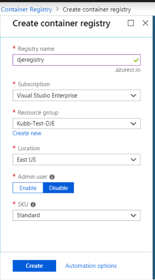

# Building an App Using Containers and Kubernetes

In this exercise, you're going to create a Kubernetes environment, upload a container to a registry, and run it. This exercise will use a mix of the Azure Portal and the CLI.

1. Create a resource group for your app. Either click through the portal or use the CLI. Either way, make sure you create the group in the East US region. AKS is not available in the North Central Region.

```powershell
$kubernetesResourceGroup="<something unique>"
az group create -l eastus -n $kubernetesResourceGroup
```

2. Create an Azure container registry to hold your images. 

**Portal**
Search for "Container Registry" and entering a unique name and resource group from step 1. You can also run the following CLI commands.



**CLI**
```powershell
# make sure the $kubernetesResourceGroup variable is set or just replace it with the name of your resource group
$ACR_NAME='<registry-name>' #change this name (make it lowercase and unique)
az acr create --resource-group $kubernetesResourceGroup --name $ACR_NAME --sku Standard --location eastus
```

>Think of a container registry like you'd think of a NuGet or NPM repository, just for whole applications instead of libraries. When you build your apps, you can compile them into docker images. This is where you put those images for later deployment.

3. Build your docker images and upload them to Azure Container Registry

```powershell
# Replace "$home/azuretraining/kubernetes-cli/src/restaurant-frontend" with the location of the code on your machine.
# Make sure the $ACR_NAME variable is set or just replace it with what you made in the previous step.
az acr build --registry $ACR_NAME --image restaurant-frontend:v1.0.0 $home/azuretraining/kubernetes-cli/src/restaurant-frontend
```

> This step builds the application, compiles it into a Docker image, and then uploads that image to the Azure Container Registry. If this was a local project and you had docker installed, you could run `docker build` and push the image to the registry. Azure container registry does this for you.

When you are done, run the following command to see your registry.

```powershell
az acr repository list --name $ACR_NAME --output table
```
Make note of the AcrID that is returned, we will need it later.
You should see the following.

```powershell
Result
------------
restaurant-frontend
```

4. Grant your application permission to pull images from your container repository.

> This step requires a service principal to be created. If you're running this on your own subscription, make a principal using the following command: `az ad sp create-for-rbac --skip-assignment` the result of this command will contain an appId and a password. Keep track of these. <br /><br/> If you are running this on a corporate network, you are not allowed to do this, and we'll give you an app id and password.

```powershell
az role assignment create --assignee $appId --scope $acrID --role acrpull
```

5. Make a kubernetes cluster. You can do this in the CLI or using the Azure Portal.

**Portal**
* In the Portal, click "Create a Resource" and search for "Kubernetes". 
* Then select Kubernetes Service.
* Click Create
  * Select the resource group you made in step 1.
  * For the name, use "OrderingAppCluster".
  * Select East US for the region.
  * for DNS name prefix, type in your user ID plus "-orderingappcluster"
  * Click Next
* On the Authentication screen, enter in the service principal ID and Client Secret given and then click Next.
* On the Networking screen, click Next
* On the Monitoring screen, click Next

**CLI**
```powershell
az aks create `
    --resource-group $kubernetesResourceGroup `
    --name OrderingAppCluster `
    --node-count 1 `
    --service-principal $appId `
    --client-secret $password `
    --generate-ssh-keys `
    --location eastus
```

> This will take a few minutes. Stretch and/or grab a delightful beverage.

> Now you have your own Kubernetes cluster. You can host a single application or dozens of them. In the next few steps, we'll take the image you created and put it in the cluster.

6. Install the Kubernetes CLI on your machine to get access to the kubctl tool we'll use in the next few steps. Run the following commands and follow the on-screen instructions.

```powershell
az aks install-cli
```

7. Verify your AKS Cluster.

```powershell
az aks get-credentials --resource-group $kubernetesResourceGroup --name OrderingAppCluster
kubectl get nodes
```

You should see something like this

```powershell
NAME                       STATUS   ROLES   AGE   VERSION
aks-nodepool1-31029395-0   Ready    agent   3m    v1.11.8
```

8. Let's get the name of your container registry

```powershell
az acr list --resource-group $kubernetesResourceGroup --query "[].{acrLoginServer:loginServer}" --output table
```

You should get something that looks like this

```powershell
AcrLoginServer
--------------------------
testappregistry.azurecr.io
```

9. Setup your deployment file

* Open up ./azuretraining/kubernetes-cli/frontend-deployment.yaml
* find the line with the following `image: restaurant-frontend:v1.0.0`
* prefix the image name with the url from the previous step | example: `image: testappregistry.azurecr.io/restaurant-frontend:v1.0.0`

> Deployment files tell your Kubernetes cluster what containers to run and how to run them. This file defines an single application and exposes it via a service.

10. Apply the deployment

```powershell
kubectl apply -f ./azuretraining/kubernetes-cli/frontend-deployment.yaml
```

> Applying a deployment causes Kubernetes to spin up the resources specified.

11. Check your work

```powershell
kubectl get service restaurant-frontend --watch
```

>This command will keep refreshing. Once you see an entry under "External-IP", head to that URL in your web browser. You should see the "Back Office" application. The result will look like this:

```powershell
NAME                  TYPE           CLUSTER-IP     EXTERNAL-IP      PORT(S)        AGE
restaurant-frontend   LoadBalancer   10.0.218.140   137.135.92.218   80:31553/TCP   55s
```

> When you're done, go ahead and ctrl+c to close the command. 

### Further Exploration
Go to the portal and check out the resources you made. You can also explore the pods you deployed using `kubectrl get pods` or explore some of the other kubernetes concepts using the `kubectl explain --help`.

Congrats, you just created a Kubernetes container registry, uploaded a container to it, build a Kubernetes cluster, and deployed an application on it. In the next exercise, you'll create a serverless application.

Next: [Azure Functions and CosmosDB with ARM templates](06-serverless.md)
