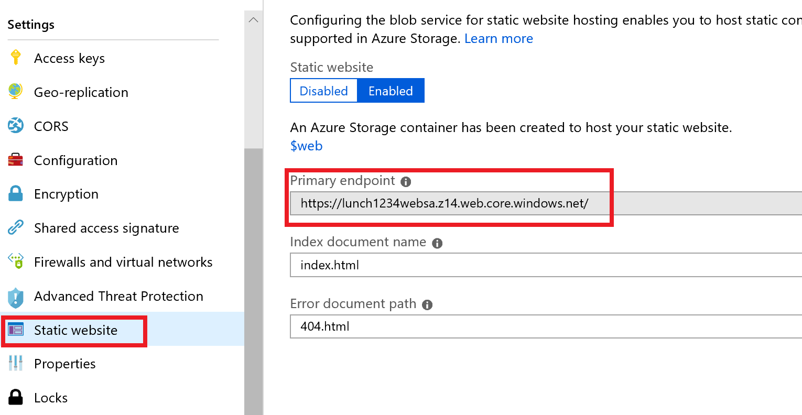

# Azure Functions and CosmosDB with ARM templates

In this exercise you will deploy a static single page application and backing web service using serverless technologies. (no servers to manage or scale, charges will be entirely based on resource usage).

The application consists of an ASP.Net Core API project and an Angular single page application.  The API will be hosted in Azure Functions using a consumption based pricing model and the static SPA website will be served directly from Azure storage and the data will be stored in a Cosmos DB database.

All resources will be created with ARM templates.

## ARM templates

1. Open the ARM template file **c:\azuretraining\serverless-cli\src\ServerlessFoodOrder.ArmTemplates\azuredeploy.json**. This is the root ARM template which references the child ARM templates in the "templates" folder.  Review the resources that will be created when you deploy this template.  To open in Visual Studio Code run:

    ```powershell
    code c:\azuretraining\serverless-cli\src\ServerlessFoodOrder.ArmTemplates\azuredeploy.json
    ```

    > Some items to note about the template:
    >    - All of the resource types in azuredeploy.json are of type "deployment".  A deployment is itself a type of resource which is used to track the inputs, outputs, and status of the deployment, which itself could include additional child deployments.
    >    - Some of the resources have dependencies on other deployments. Azure Resource Manager will figure out the dependency graph and deploy as many resources in parallel as it can.
    >    - The child templates are referenced by a URL (built from the _artifactsLocation parameters) NOT from a local file path.  Azure Resource Manager runs in the cloud and must be able to download the child templates from an internet accessible location.  The deployment script will create a storage account, upload the child templates, and pass this URL in as a parameter.
    >    - All child templates get their parameters passed to them from the parent template.
    >    - The function app template gets some of its parameters from the output of the other templates. For example - the access key for the CosmosDB instance is output from the cosmosdb.json ARM template and this value is passed into the Function App ARM template so the key can be stored in the Function App's configuration settings.

2. Open the **c:\azuretraining\serverless-cli\src\ServerlessFoodOrder.ArmTemplates\azuredeploy.parameters.json** file.  This file contains the parameter values that will be passed to the ARM template.  All of the resources we are creating **must have a unique name**, so the ARM template will prepend all resource names with the value of the **"uniqueString"** parameter.  Update the **"uniqueString"** value by replacing **"[Your CMUTUAL user name here]"** with your user name:

    ```json
    "parameters": {
        "uniqueString": {
            "value": "shk6756"
        },
        ...
    ```

4. Run the deployment script. This will take a while to provision all of the resources. All resources will be created in a new resource group named **[Your CUNA user name]-lunch-serverless-rg**.

    ```powershell
    c:\azuretraining\serverless-cli\src\ServerlessFoodOrder.ArmTemplates\Deploy-AzureResourceGroup.ps1 `
        -ResourceGroupName "$env:username-lunch-serverless-rg"
    ```

    > What is happening with this command:
    >
    > The Deploy-AzureResourceGroup.ps1 script is the default script created by Visual Studio when you make a new ARM Template project.  When it runs it:
    >  1. Creates the target resource group if it doesn't exist
    >  2. Creates a storage account (if it doesn't already exist) to store the deployment artifacts. This includes all ARM templates and a zip file of the compiled Function App.
    >  3. Creates a time limited SAS token that ARM can use to access the artifacts.
    >  4. Uploads the artifacts to the storage account.
    >  5. Executes the ARM template using the New-AzureRmResourceGroupDeployment command, passing in the root ARM template, parameter file, and parameter values for the artifact storage account URL and SAS token.

7. While the deployment is running we will update the single page app with the URL of our API. Go to the **c:\azuretraining\serverless-cli\src\ServerlessFoodOrder.Web\dist** folder and edit **index.html**.

    Change the section

    ```javascript
    var globalConfig = {
      apiDomain: "https://[Your CMUTUAL user name]-lunch-func-fa.azurewebsites.net"
    };
    ```

    by replacing **"[Your CMUTUAL user name]"** with your user name like you did in the azuredeploy.parameters.json file. For example: 

    ```javascript
    var globalConfig = {
      apiDomain: "https://shk6756-lunch-func-fa.azurewebsites.net"
    };
    ```
    
    > Normally this process would be done as part of a build pipeline.

8. Wait for the deployment to complete. It may take several minutes to provision all resources.

9. Enable static website hosting on your web storage account.  There currently isn't a way to do this via ARM templates, so we must execute a command to update the existing storage account.

    ```powershell
    az storage blob service-properties update `
        --account-name "$($env:username)lunchwebsa" `
        --static-website `
        --404-document 404.html `
        --index-document index.html
    ```

10. Upload the website to the $web container in the storage account created by the static website hosting feature.

    ```powershell
    # The "$web" value here is not a PowerShell variable (notice the single, 
    # not double, quotes).  "$web" is the name of the storage container that 
    # Azure creates when you enable static site hosting
    az storage blob upload-batch `
        --source c:\azuretraining\serverless-cli\src\ServerlessFoodOrder.Web\dist `
        --destination '$web' `
        --account-name "$($env:username)lunchwebsa"
    ```

11. Update the CORS settings to allow cross
    * Get the url for your static site

    ```powershell
    $staticWebUrl = az storage account show `
        --resource-group "$env:username-lunch-serverless-rg" `
        --name "$($env:username)lunchwebsa" `
        --query "primaryEndpoints.web" --output tsv
    $staticWebUrl = ($staticWebUrl).Replace(".net/",".net")
    ```
    * Add it as an allowed origin to the CORS settings on your function app
    
    ```powershell
    az functionapp cors add `
        --resource-group "$env:username-lunch-serverless-rg" `
        --name "$env:username-lunch-func-fa" `
        --allowed-origins $staticWebUrl
    ```

12. The **$staticWebUrl** PowerShell variable contains the URL to your static website that hosts the single page application. Print out that value:

    ```powershell
    $staticWebUrl
    ```

13. Open a browser tab to this URL.  The home page should be displayed with a list of pre-populated menu items.

    

### Further Exploration
Go to the portal and check out the resources you made. Try to add a simple function to the project or create a new function app. Play with some different triggers and see what you can build.

Congrats, you just created a serverless application using Azure Functions, Cosmos DB, and a static web site. In the next exercise, you'll create a service bus.

Next: [Azure Service Bus](07-messaging-service-bus.md)
