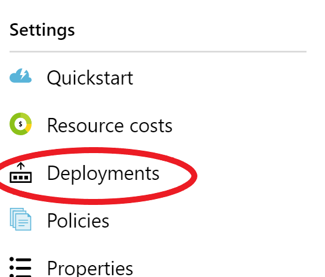

# Network Security

In this exercise we will secure the Azure Web App created in exercise #4 at the networking layer.  We will lock down access to the application to a private VNet, apply Network Security Group filters, and expose the site to the internet through an Application Gateway.

## Protect against common OWASP attacks with Application Gateway and the Web Firewall

Our application has a SQL injection issue.  Load the API endpoint /api/menu?filter=Sandwich in your browser.  It will return only menu items with the text "Sandwich" in them.
However, the developers didn't properly parameterize the SQL WHERE clause, so it is vulnerable to injection attacks.  Enter the URL:

/api/menu?filter=%'; UPDATE MenuOption SET Name=Name+' HACKED!'--

in your browser, then load the /api/menu URL again.  You will see that the names of the products have been changed.

To protect against issues like this we will put the site behind an Application Gateway with the Web Firewall feature enabled.

1.

## Create a service endpoint to Azure SQL

1. Deploy the ARM template that will set up a VNet with one private subnet and a VM in it we can use for testing.

```powershell
# If your $uniqueString and/or $resourceGroupName variables are not set, set them  here
# $uniqueString = "$(Get-Random 99999)"
# $resourceGroupName = "azure-training-rg"
az group deployment create --resource-group "$resourceGroupName" --template-file ./security-web-apps/azuredeploy.json --parameters '@./security-web-apps/azuredeploy.parameters.json' --parameters "{'uniqueString': { 'value': '$uniqueString' }}"
```

2. Open up the portal (https://portal.azure.com) and navigate to your resource group.  Click on the Deployments link on the left hand side to see the status of the deployments.

    

3. Once the deploy is complete open the Virtual Network resource "security-vnet"

4. Select the "Service endpoints" menu option

    

5. Click "Add"

6. Select the "Microsoft.Sql" service and the "service-sn" subnet from the drop downs.

This will switch outgoing traffic from your private subnet to this Azure service to use your private address space, allowing you to lock down the Azure service to specific resources inside your private virtual network address space. 

3. Go back to your resource group and open the VM resource "security-vm".

4. Select the Settings --> Networking menu option on the left

5. Take note of the "Private IP" address.  Because you created a service endpoint for Azure SQL on this VNet requests to Azure SQL will stay within the Azure network and connect from the private IP address instead of traversing the internet and appearing as the public IP address.  This means that giving this VM a publicly addressable IP is not necessary.  However, we will keep the public address around so we can RDP into the machine to test our configuration.

    

## Configure Azure SQL to whitelist your subnet

6. Navigate back to the resource group with your Azure SQL Server and select that resource (make sure to select the "SQL server" resource type, not the "SQL database").

7. Select the Security --> Firewalls and virtual networks menu option on the left

    

8. Make sure "Allow access to Azure services" is "Off".  We want to make sure that we are truly blocking all traffic except 

. Under the Virtual Networks section click "+ Add existing virtual network"

9. Enter a unique name for the rule and select the "security-vnet" virtual network and "security-sn" subnet from the drop downs.

10. Get conn str

10. Connect to the VM using RDP.  On Properties Page --> Click Connect to Download RDP file --> Save and Open RDP file.

    Note: After selecting the subnet the status of the service endpoint for Azure SQL in this VNet will be displayed.  If you did not create a service endpoint earlier the portal will give you the option to create it from this menu.

11. Click "OK" to create the rule.


5. Log in with the user name "securitytraining" and password "Security1!"

6. Open the Start menu and start Microsoft SQL Server Tools 17 --> SQL Server MAnagement Studio

7. Enter your database URL ([your SQL server name].database.windows.net), select SQL authentication, and enter the admin user name and password for your Azure SQL Server.

8. You should be connected to the server and be able to execute SQL commands.  Even though access to all Azure services have been removed and no IP addresses are in the whitelist, you can connect to the server through your VM since it is in a VNet that has an Azure SQL Server Service Endpoint and is in a subnet that has been granted access to the SQL Server.

9. Shut down the virtual machine.

10. 

## 
