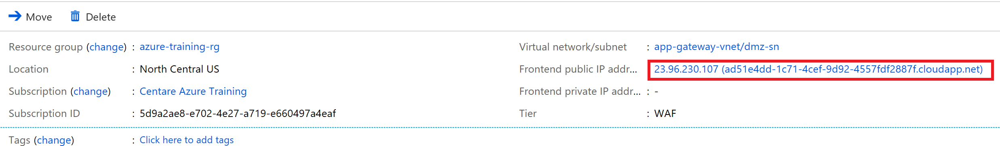

# Create an Application Gateway

Our lunch API App Service has a SQL injection issue.  Load the API endpoint with the URL
**https://[Your CMUTUAL user name]-lunch-api-as.azurewebsites.net/api/menu?filter=Soda**
in your browser.  It will return only menu items with the text "Soda" in them.

> If you get a **Client with IP address XXX.XXX.XXX.XXX error you have to go back to your SQL server firewall settings and enable traffic from Azure services.

However, the developers didn't properly parameterize the SQL WHERE clause, so it is vulnerable to injection attacks.  Enter the URL:

**https://[Your CMUTUAL user name]-lunch-api-as.azurewebsites.net/api/menu?filter=%'; UPDATE menu.MenuOption SET Name=Name%2B' HACKED!'--**

in your browser, then load the /api/menu URL again.  You will see that the names of the products have been changed.

To protect against coding issues like this we will put the site behind an Application Gateway with the Web Firewall feature enabled.

This exercise can be done through the portal or using the Azure CLI.

## Create an Application Gateway using the portal

1. Click the **Create a resource** button in the upper left menu.

2. Select **Networking --> Application Gateway** or search for **Application Gateway** in the search box.

3. Fill out the **Basics** form:
    - Enter **"lunch-api-agw"** for the **Name**
    - Select the **Resource Group** with your API App Service
    - Select the **East US** location
    - Select **WAF V2** for the **Tier**
    - Keep all other values at the defaults.
    - Click **OK**

    > We are picking the East US location since our normal North Central US location does not support version 2 of the Web Application Firewall.  The reason we want version 2 is simply because it deploys faster (5-6 minutes vs up to 20+ minutes). We will not be using any v2 functionality.  In a production scenario we probably wouldn't put the App Gateway in a different region that the App Service it is protecting.

4. Fill out the **Settings** form:
    - Create a new virtual network for the App Gateway named **"app-gateway-vnet"**
    - Use 10.0.1.0/24 for the address space.
    - Create a subnet named **"dmz-sn"** with an address space of 10.0.1.0/29
<!--
    > Application Gateway consumes one private IP address per instance, plus another private IP address if a private frontend IP configuration is configured. Also, Azure reserves the first four and last IP address in each subnet for internal usage. For example, if an application gateway is set to three instances and no private frontend IP, then a /29 subnet size or greater is needed. In this case, the application gateway uses three IP addresses. If you have three instances and an IP address for the private frontend IP configuration, then a /28 subnet size or greater is needed as four IP addresses are required.
-->
    - Click **OK** to create the VNet
    - Make sure the **Web application firewall** status is **Enabled**
    - Change the **Firewall mode** to **Prevention**
    - Click **OK** again to save settings
    > Note we are keeping the app gateway in HTTP mode instead of HTTPS. You would likely never do this but for the sake of this exercise we don't want to have to manage SSL certificates.

5. Click **OK** on the **Summary** step

6. Wait for the App Gateway to be deployed. This may take a while (up to 20 minutes) so now is a good time to take a break.

    > You can navigate to the resource before it is fully deployed. Wait until the deployment is complete before continuing on to the next step.

7. Open the **lunch-api-agw** resource.

8. Click **Back end pools** in the left menu.

9. Select the **appGatewayBackendPool**

10. In the **Targets** drop down select **App Services**

11. In the app service drop down select your API app (lunch-[your unique key]-api-as)

12. Click **Save**

13. Click on **Health probes** in the left menu and click **Add**

14. Enter the name **"default-agwhp"**

15. Check the **Pick host name from backend HTTP settings** checkbox

16. Enter **"/"** in the **Path**

17. Click **OK**

18. Click **HTTP settings** in the left menu

19. Select **appGatewayBackendHttpSettings**

20. Check the **Use for App Services** checkbox and select your **default-agwhp** health probe from the drop down list.

21. Click **Save**

13. Click the **Overview** menu option for the App Gateway and get the public DNS name of the App Gateway from the **Frontend public IP address** field

    

14. Continue on to the **"Attempt a SQL injection attack"** section to test your gateway.

## Create an Application Gateway using the portal

1. Create a new virtual network with one subnet to hold your application gateway.

    ```powershell
    $resourceGroupName = "$env:username-lunch-webapp-rg"
    $location = "eastus"
    $vnetName = "app-gateway-vnet"
    $appGatewaySubnetName = "dmz-sn"

    az network vnet create `
        --name $vnetName `
        --resource-group $resourceGroupName `
        --location $location `
        --address-prefix 10.0.0.0/16 `
        --subnet-name $appGatewaySubnetName `
        --subnet-prefix 10.0.1.0/24 `
        --verbose
    ```

    > We are picking the East US location since our normal North Central US location does not support version 2 of the Web Application Firewall.  The reason we want version 2 is simply because it deploys faster (5-6 minutes vs up to 20+ minutes). We will not be using any v2 functionality.  In a production scenario we probably wouldn't put the App Gateway in a different region that the App Service it is protecting.

2. Create a public IP address for your app gateway so it can be accessed from the internet

    ```powershell
    $publicIpAddressName = "lunch-app-gateway-ip"

    az network public-ip create `
        --resource-group $resourceGroupName `
        --location $location `
        --sku Standard `
        --name $publicIpAddressName `
        --verbose
    ```

3. Create a WAF V2 Application Gateway. This will take some time (up to 5-6 minutes).

    ```powershell
    $appGatewayName = "lunch-api-agw"
    $apiAppDnsName = "$env:username-lunch-api-as.azurewebsites.net"

    az network application-gateway create `
        --name $appGatewayName `
        --location $location `
        --resource-group $resourceGroupName `
        --capacity 2 `
        --sku WAF_v2 `
        --http-settings-cookie-based-affinity Enabled `
        --public-ip-address $publicIpAddressName `
        --vnet-name $vnetName `
        --subnet $appGatewaySubnetName `
        --servers "$apiAppDnsName" `
        --verbose
    ```

4. Update your application gateway settings to support App Services (look up the host name from the pool):

    ```powershell
    az network application-gateway http-settings update `
        --name appGatewayBackendHttpSettings `
        --gateway-name $appGatewayName `
        --resource-group $resourceGroupName `
        --host-name-from-backend-pool true
    ```

5. Enable the Web Application Firewall in "Prevention" mode (as opposed to "Detection"). This will cause potentially harmful requests to be rejected by the firewall instead of just logged.

    ```powershell
    az network application-gateway waf-config set `
        --gateway-name $appGatewayName `
        --resource-group $resourceGroupName `
        --enabled true `
        --firewall-mode Prevention `
        --rule-set-version 3.0
    ```

6. Retrieve the public IP address of the gateway

    ```powershell
    $appGatewayIp = (az network public-ip show `
    --resource-group $resourceGroupName `
    --name $publicIpAddressName `
    --query ipAddress).Replace('"', '')
    Write-Host "You can reach your application gateway at: http://$appGatewayIp"
    ```

## Attempt a SQL injection attack

1. Open a browser tab to the app gateway and attempt a SQL injection attack like:

    https://[App Gateway GUID].cloudapp.net/api/menu?filter=%'; UPDATE menu.MenuOption SET Name=Name%2B' HACKED!'--

    You should get a **403 - Forbidden: Access is denied to the resource** since the Application Gateway detected a potential SQL injection attack

Next: [SQL Data Security](11-sql-data-security.md)