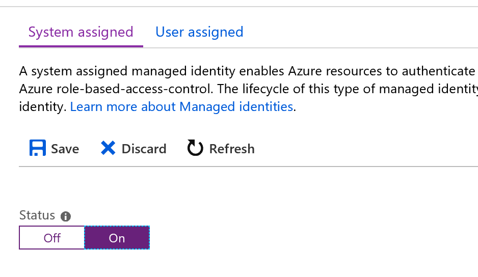
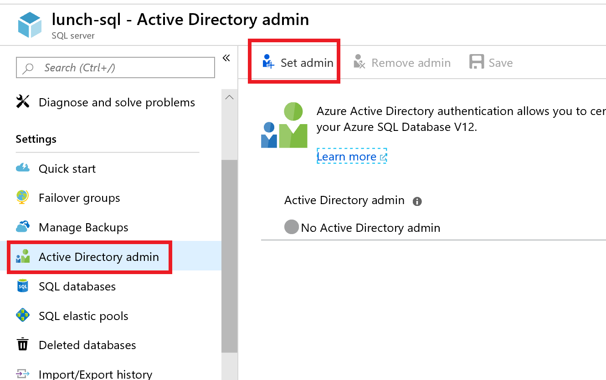

# Managed Service Identities with App Services and Azure SQL

In this exercise we will enable a Managed Service Identity (MSI) for your API App Service, allowing you to remove the sensitive credentials from your application settings.  Azure will create and manage the credentials for the service principal and provide access to a token for this user which can be used to connect to Azure SQL.

## Enable a Managed Service Identity for your API App Service

1. Go to the [Azure Portal](portal.azure.com) and navigate to the **lunch-XXX-api-as" App Service you created that runs the API for the lunch ordering site.

2. Click on **Settings --> Identity** in the left hand menu.

3. Under the **System Assigned** tab change the **Status** from **Off** to **On** and click **Save**.  Click **Yes** to confirm the popup.

    

    A new service principal was created for the app service and it now has access to generate tokens from Azure Active Directory for the identity without you having to manage any credentials.

4. Navigate to the **lunch-XXX-sql** Azure SQL Server your created to

5. Click on the **+ Set Admin** button at the top.

    

6. Search for your account and click **Select**, then click **Save**.