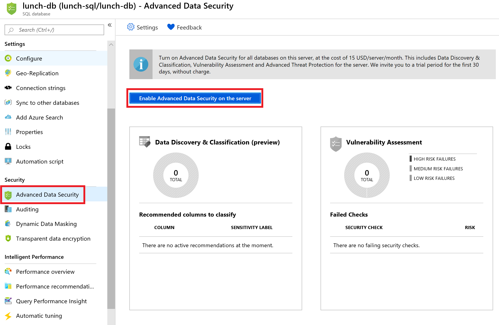
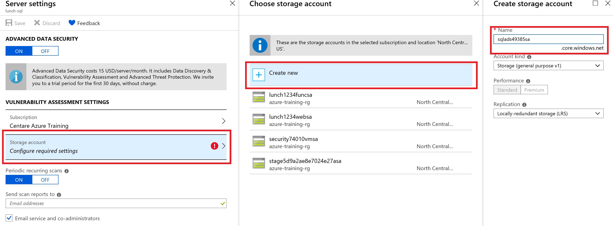
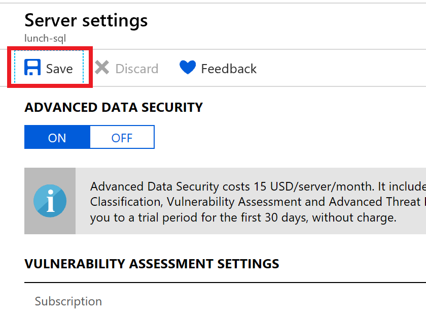
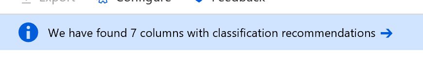
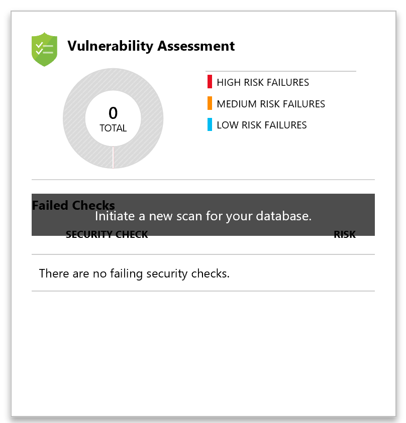

# Data security with Azure SQL

In this lab we will enable some of the data security features on our Azure SQL database. We will turn on Advanced Data Security to see potential issues with our database and Transparent Data Encryption to secure access to sensitive fields.

## Advanced Data Security

1. In the [Azure Portal](portal.azure.com) navigate to the "lunch-db" Azure SQL database resource you created earlier.

2. In the left menu click on the **Security --> Advanced Data Security** menu item

3. Click on the **Enable Advanced Data Security on the server** button

    

4. Click on the **Select storage** button when prompted for a storage account for your Vulnerability Assessment

5. Under the **Storage account** section click **Configure Required Settings**, then **Create new**. Enter a unique storage account name like "sqlads[unique string]sa" and click **OK**.

    

6. Click on **Advanced Protection Types** (defaults to All) to see the types of things ADS will protect you against.  Keep the selection at **All**.

7. Click the **Save** button at the top and click the **X** to close the settings blade.

    

8. Click the **Data Discovery & Classification (preview)** graph.  

9. Click the blue **We have found 7 columns with classification recommendations** notification bar

    

10. Notice that ADS has found several columns it thinks contain sensitive data. From here you can accept ADS's recommendations to save and monitor the list of sensitive fields in your database.

11. Click on the **Vulnerability Assessment chart** to initiate a new scan

    

12. Notice that the scan found several issues for you to review.  Click on them to read details on the issue and remediation suggestions.

13. Click on the **Passed** tab to see a full list of the other security checks the scan performed.

Next: [Storage SAS](12-storage-sas.md)

<!-- 
TODO: Finish based on script below
TODO: Update web app to use Azure AD auth if a flag is set in the config

# Create group to hold MSI account, directly assigning SQL access to a service principal isn't supported
# See https://docs.microsoft.com/en-us/azure/active-directory/managed-service-identity/tutorial-windows-vm-access-sql
$RoleName = "Managed Service Identity access to $DatabaseName"
$Group = Get-AzureRmADGroup -DisplayName $RoleName
if (!$Group)
{
	Write-Host "Group $RoleName does not exist, creating..."
	$Group = New-AzureRmADGroup -DisplayName $RoleName -MailNickName "NotSet"
}

foreach ($ApplicationName in $ApplicationNames)
{
	$Principal = (Get-AzureRmADServicePrincipal -SearchString $ApplicationName)
	$Member = Get-AzureRmADGroupMember -GroupObjectId $Group.Id | Where-Object Id -Eq $Principal.Id
	if (!$Member)
	{
		Write-Host "Add service principal $Principal.Id to group $Group.Id"
		Add-AzureRmAdGroupMember -TargetGroupObjectId $Group.Id -MemberObjectId $Principal.Id -PassThru
	}
	else
	{
		Write-Host "Service principal $Principal.Id already exists in group $Group.Id"
	}
}

# Note we could also do this in the DACPAC...
& $SqlCmdExePath `
	-S tcp:$ServerName -d $DatabaseName `
	-U $UserName -P $Password `
	-G -l 30 `
	-Q "CREATE USER [$RoleName] FROM EXTERNAL PROVIDER; 
ALTER ROLE db_datareader ADD MEMBER [$RoleName]; 
ALTER ROLE db_datawriter ADD MEMBER [$RoleName];"
-->
