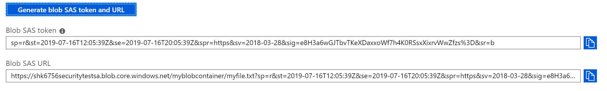

# Use Storage SAS tokens to access a file

In this exercise you will create a storage access signature to read a file from blob storage.

## Create a storage account and container

1. Navigate to the Azure Portal

2. In the left hand menu click **Create a Resource**.

3. Select Storage Account.

> An Azure storage account contains all of your Azure Storage data objects: blobs, files, queues, tables, and disks. The storage account provides a unique namespace for your Azure Storage data that is accessible from anywhere in the world over HTTP or HTTPS.

4. Fill out the storage account form:
    - Select one of your **Resource Groups** (e.g. *myusername-lunch-webapp-rg*)
    - Enter a unique name for the storage account (e.g. *[myusername]securitytestsa*)
    - You can leave all other fields as the defaults

5. Click the **Review + create** then **Create** buttons

6. Wait for your storage account to be created. Once it is complete click on **Go to your resource**.

7. Click on the **Blobs** tile.

> BLOB stands for "Binary Large OBject".  Azure Blob storage is Microsoft's object storage solution for the cloud. Blob storage is optimized for storing massive amounts of unstructured data. Unstructured data is data that does not adhere to a particular data model or definition, such as text or binary data.

8. Click the **+ Container** button to create a new blob storage container.

7. Enter in a **Name** value. Names can only contain lower case letters, numbers, and hyphens. Leave the **Public access level** at **Prvivate**.  Click **OK**.

8. Click on the blob container you just made.

## Upload a file and generate a shared access signature

9. Click **Upload**

10. Choose any small file from your machine to add to the container and click **Upload**.

11. Click on the file you uploaded and select the **Generate SAS** tab.

> SAS tokens will usually be generated programatically by your application and shared with the user to give them temporary access to read or write files to the container.

12. Leave all of the default values and click **Generate blob SAS token and URL**. The portal will display your generated SAS token plus the full URL that can be used to access the file.

> The file URL is just the path to the file (https://[storage account name].blob.core.windows.net/[blob container name]/[file name]) with the sas token in the URL.  Anyone with this URL can read this file since we didn't add any IP restrictions.

> Notice that the shared access signature actually contains the restrictions we specified as plain text strings.  What makes the SAS secure is the *sig* value, which is a cryptographic hash of the rest of the values created using the storage container's *access key*.

## Use the shared access signature

13. Copy the file URL with the SAS token, open a new browser tab and paste the URL in.  Your browser will download the file.

14. Change the URL to **http://** instead of **https://**.  Azure will display a message that HTTP is not allowed.

15. Change the URL back to **https://** and attempt to modify the URL (). Azure will block access to the file if the signature does not match the parameters.

Next: [SQL Data Security](11-sql-data-security.md)
